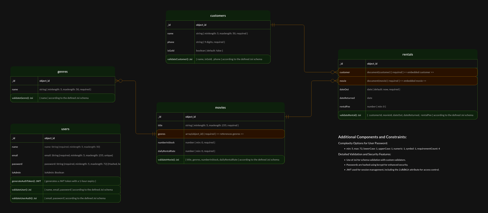

# Movie Rental System API

## Description

The Movie Rental System API is a robust Node.js application designed to streamline the management of movie rentals,
customer interactions, and inventory control. Leveraging MongoDB with Mongoose for data management and Express for
creating RESTful endpoints, it simplifies movie rental operations while ensuring scalability and maintainability. Docker
is utilized to facilitate deployment and scaling of the application across different environments.

## System Architecture Diagram



## Features

- **Movie Management**: Create, update, retrieve, and delete movies along with detailed attributes like stock levels and
  rental rates.
- **Genre Management**: Manage movie genres, providing functionalities for adding new genres and updating existing ones.
- **Customer Management**: Handle customer records, including adding new customers and updating existing customer
  information.
- **Rental Operations**: Support rental transactions, tracking details such as rental periods and fees.
- **User Authentication**: Secure the application by managing user sessions and authorizations through JWT.

## In-Progress Features

- **Advanced Search Capabilities**: Enhancing the search functionality to include filtering by genre, director, and
  availability.
- **Dynamic Pricing Model**: Implementing pricing algorithms that adjust rental rates based on demand and popularity.

## Getting Started

### Prerequisites

- Node.js (preferable LTS v20.11.1. or higher)
- Docker
- Docker Compose
- MongoDB instance (local or remote)

### Installation

1. Clone the repository:
   ```
   git clone [repository_url]
   ```
2. Navigate to the project directory:
   ```
   cd movie-rental-app
   ```

### Running the Application

1. Install dependencies:
   ```
   npm install
   ```
2. Start the application using Docker Compose:
   ```
   docker-compose up --build
   ```
   This command sets up the MongoDB database and runs the application.

### Accessing the Application

Once the application is running, access it at:

```
http://localhost:3000
```

## Technical Specifications

### Technology Stack
- **Node.js**: A runtime environment for executing JavaScript on the server-side.
- **Express**: A minimal and flexible Node.js web application framework that provides robust features for web.
- **MongoDB**: A NoSQL database used to store all application data in a flexible schema format.
- **Mongoose**: An ODM (Object Data Modeling) library for MongoDB and Node.js that manages relationships between data and provides schema validation.
- **Joi**: A schema description language and data validator for JavaScript.
- **JWT (JSON Web Tokens)**: A compact, URL-safe means of representing claims to be transferred between two parties, used for secure user authentication.
- **Bcrypt**: A library to help hash passwords securely.

### System Architecture
The system is structured using the MVC (Model-View-Controller) pattern, ensuring separation of concerns and scalability. Here is a breakdown of the project's structure:

- **/src**: Contains all source files.
    - **/api**: Contains router and controller logic for each domain entity (movies, genres, customers, rentals, users).
    - **/models**: Includes Mongoose schemas for the entities.
    - **/services**: Business logic implementation for each entity.
    - **/middleware**: Custom Express middleware for authentication and validation.
    - **/errors**: Custom error classes to handle application-specific errors gracefully.

## API Endpoints

The application provides several RESTful endpoints:

### Movies

- **POST /api/movies**
    - Description: Create a new movie record.
    - Request Body: `MovieDto`
    - Response: `201 Created`

- **GET /api/movies**
    - Description: Retrieve a list of all movies, with pagination.
    - Query Params: `page`, `size`
    - Response: `200 OK`

- **GET /api/movies/{id}**
    - Description: Retrieve a specific movie by its ID.
    - Response: `200 OK`

- **PUT /api/movies/{id}**
    - Description: Update a movie record by ID.
    - Request Body: `MovieDto`
    - Response: `200 OK`

- **DELETE /api/movies/{id}**
    - Description: Delete a specific movie by its ID.
    - Response: `204 No Content`

### Genres

- **POST /api/genres**
    - Description: Add a new genre.
    - Request Body: `GenreDto`
    - Response: `201 Created`

- **GET /api/genres**
    - Description: List all genres.
    - Response: `200 OK`

- **GET /api/genres/{id}**
    - Description: Retrieve a specific genre by its ID.
    - Response: `200 OK`

- **PUT /api/genres/{id}**
    - Description: Update a genre by ID.
    - Request Body: `GenreDto`
    - Response: `200 OK`

- **DELETE /api/genres/{id}**
    - Description: Remove a genre by ID.
    - Response: `204 No Content`

### Customers

- **POST /api/customers**
    - Description: Register a new customer.
    - Request Body: `CustomerDto`
    - Response: `201 Created`

- **GET /api/customers**
    - Description: Fetch all customers.
    - Query Params: `page`, `size`
    - Response: `200 OK`

- **GET /api/customers/{id}**
    - Description: Get details of a specific customer.
    - Response: `200 OK`

- **PUT /api/customers/{id}**
    - Description: Update customer details.
    - Request Body: `CustomerDto`
    - Response: `200 OK`

- **DELETE /api/customers/{id}**
    - Description: Delete a customer record.
    - Response: `204 No Content`

### Rentals

- **POST /api/rentals**
    - Description: Record a new rental.
    - Request Body: `RentalDto`
    - Response: `201 Created`

- **GET /api/rentals**
    - Description: View all rental records.
    - Query Params: `page`, `size`
    - Response: `200 OK`

- **GET /api/rentals/{id}**
    - Description: Retrieve details of a specific rental.
    - Response: `200 OK`

- **DELETE /api/rentals/{id}**
    - Description: End a rental agreement.
    - Response: `204 No Content`

## Configuration
Sensitive information and configuration details like database connection strings and JWT secrets are managed through environment variables, ensuring security and flexibility across different deployment environments.

## Deployment
The application is containerized using Docker, facilitating easy deployment and scaling. Docker Compose is utilized to orchestrate the multi-container setup, including the Node.js application and MongoDB database service.

## Security Practices
- **JWT Authentication**: Secures API endpoints, ensuring that only authenticated users can access specific functionalities.
- **Password Hashing**: User passwords are hashed using bcrypt before storing in the database, preventing password theft.
- **Validation Middleware**: Request data is rigorously validated using Joi and custom middleware to prevent invalid data handling and injection attacks.

## Error Handling

The system is equipped with custom error handling to ensure clear feedback is provided to the client in case of
failures.

## Contributing

Contributions to the Movie Rental System API are encouraged. Please follow these guidelines for your submissions:

- Provide clear and concise commit messages.
- Include comments in your code where necessary.
- Ensure code adheres to the established coding standards.

## License

This project is licensed under the MIT License - see the LICENSE.md file for details.